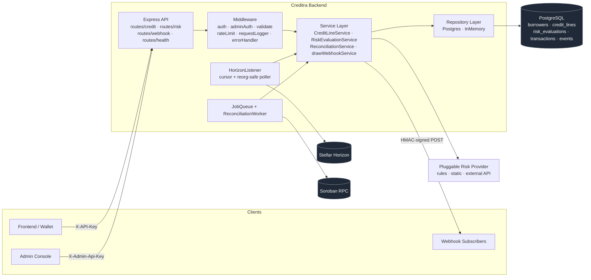

# Creditra Backend


> **Creditra** is a decentralized, risk-priced credit protocol on Stellar/Soroban. Loans are priced from on-chain behavioral signals — **no overcollateralization**. This repository is the off-chain backend: the API, the signal collector, the Horizon indexer, the reconciliation worker, and the webhook fan-out that hold the protocol together.

The differentiator is not "another DeFi lender." It is the **signal pipeline**: behavioral inputs from the chain are normalized, weighted, and handed to the on-chain underwriting contract so that interest rates and limits scale with risk rather than with collateral. The backend's job is to make that pipeline trustworthy — every signal accounted for, every event reconciled against chain truth, every webhook delivered exactly once.

---

## Table of Contents

- [System Overview](#system-overview)
- [Quick Start](#quick-start)
- [Feature Inventory](#feature-inventory)
- [Engineering Principles](#engineering-principles)
- [Project Layout](#project-layout)
- [Documentation](#documentation)
- [Operational Notes](#operational-notes)
- [Testing](#testing)
- [Contributing](#contributing)
- [License](#license)

---

## System Overview



A request enters through the Express router, is authenticated (`X-API-Key` or `X-Admin-Api-Key`), validated by Zod schemas, and rate-limited per IP or per key. The service layer talks to repositories (Postgres in production, in-memory for tests) and to the on-chain world through Soroban RPC. The `HorizonListener` polls Stellar Horizon for contract events and writes them back through the same service layer. The `ReconciliationWorker` periodically diffs DB state against on-chain state and emits drift alerts. Confirmed events are HMAC-signed and delivered to webhook subscribers with exponential-backoff retry.

---

## Quick Start

### Prerequisites

- Node.js **>= 20**
- npm
- (Optional) Docker 24+ and Docker Compose v2 for the containerised dev loop
- (Optional) k6 for load testing

### Install

```bash
git clone https://github.com/Creditra/Creditra-Backend.git
cd Creditra-Backend
npm install
cp .env.example .env   # then fill in DATABASE_URL, API_KEYS, etc.
```

### Run

```bash
npm run dev        # tsx watch on src/index.ts → http://localhost:3000
npm run build      # tsc + copies openapi.yaml into dist/
npm start          # node dist/index.js
```

API base: <http://localhost:3000>. Swagger UI: <http://localhost:3000/docs>. Raw OpenAPI JSON: <http://localhost:3000/docs.json>.

### Database

```bash
npm run db:migrate      # runs migrations/*.sql in order, idempotent
npm run db:validate     # asserts tables/columns/indexes match the expected schema
```

Migrations live in [`migrations/`](./migrations/) and are tracked in the `schema_migrations` table by filename version. See [`docs/data-model.md`](./docs/data-model.md) and [`docs/schema-validation.md`](./docs/schema-validation.md).

### Tests & coverage

```bash
npm test                  # vitest --run
npm run test:coverage     # v8 coverage, lcov + text
npm run test:watch        # vitest in watch mode
npm run lint              # eslint src/
npm run typecheck         # tsc --noEmit
```

### Load

```bash
npm run load:smoke    # k6 — 10 VUs, smoke
npm run load:stress   # k6 — up to 100 VUs, stress
npm run load:spike    # k6 — 200 VU spike, recovery
```

### Docker

```bash
docker compose up --build         # API + Postgres, hot-reload via tsx watch
docker compose exec api npm run db:migrate
```

---

## Feature Inventory

Every entry below is grounded in real files in this repo.

### HTTP API

| Surface | Path prefix | Mounted in |
|---|---|---|
| Health & readiness | `GET /health` | [`src/routes/health.ts`](./src/routes/health.ts) |
| Credit lines (CRUD) | `/api/credit/lines` | [`src/routes/credit.ts`](./src/routes/credit.ts) |
| Credit lines by wallet | `/api/credit/wallet/:walletAddress/lines` | [`src/routes/credit.ts`](./src/routes/credit.ts) |
| Transactions | `/api/credit/lines/:id/transactions` | [`src/routes/credit.ts`](./src/routes/credit.ts) |
| Draw / repay | `POST /api/credit/lines/:id/{draw,repay}` | [`src/routes/credit.ts`](./src/routes/credit.ts) |
| Admin suspend / close | `POST /api/credit/lines/:id/{suspend,close}` (admin auth) | [`src/routes/credit.ts`](./src/routes/credit.ts) |
| Risk evaluation | `POST /api/risk/evaluate`, history endpoints | [`src/routes/risk.ts`](./src/routes/risk.ts) |
| Webhook config & test | `/api/webhooks/*` | [`src/routes/webhook.ts`](./src/routes/webhook.ts) |
| Reconciliation trigger / status | `/api/reconciliation/*` (admin) | [`src/routes/reconciliation.ts`](./src/routes/reconciliation.ts) |
| OpenAPI docs | `GET /docs`, `GET /docs.json` | [`src/index.ts`](./src/index.ts) |

Full machine-readable spec: [`src/openapi.yaml`](./src/openapi.yaml). Human-readable inventory: [`docs/API.md`](./docs/API.md).

### Service layer

- **`CreditLineService`** — repository-backed CRUD plus `draw` and `repay`. Status transitions enforced; basis-point interest rates clamped to `0..10000`.
- **`RiskEvaluationService`** — caches evaluations for 24 hours, refreshes on `forceRefresh`, derives `creditLimit` and `interestRateBps` from a normalized 0–100 score using inverse risk weighting (higher score → lower rate, larger limit).
- **`ReconciliationService` / `ReconciliationWorker`** — periodic diff of DB credit lines vs on-chain state. Severity levels: `critical` (identity, limit, status) and `warning` (available credit, rate). Runs every hour by default (`RECONCILIATION_INTERVAL_MS`).
- **`HorizonListener`** — Stellar Horizon poller with cursor persistence, exponential backoff + jitter, gap recovery, and SHA-256 idempotency cache (10k entries, LRU). Metrics exposed via `getMetrics()`.
- **`SorobanRpcClient`** — read/submit wrapper with AbortController timeouts, retry budget, and Stellar key sanitization in error messages.
- **`drawWebhookService`** — multi-URL HMAC-SHA256 webhook fan-out with retry/backoff and connectivity probe.
- **`jobQueue`** — in-process at-least-once queue with visibility timeout, attempt tracking, and dead-letter list.

Implementation files: [`src/services/`](./src/services/), entry composition in [`src/container/Container.ts`](./src/container/Container.ts).

### Pluggable risk providers

Selected via `RISK_PROVIDER` env var, factory in [`src/services/providers/providerFactory.ts`](./src/services/providers/providerFactory.ts):

- **`rules`** (default) — deterministic [`RulesEngineRiskProvider`](./src/services/providers/RulesEngineRiskProvider.ts) combining address entropy, hash spread, and prefix score.
- **`static`** — [`StaticRiskProvider`](./src/services/providers/StaticRiskProvider.ts) for tests/local dev.
- **`external`** — [`ExternalApiRiskProvider`](./src/services/providers/ExternalApiRiskProvider.ts) HTTP-pluggable provider with timeout & bearer auth.

See [`docs/SIGNALS_INGEST.md`](./docs/SIGNALS_INGEST.md) for the end-to-end signal pipeline.

### Persistence

- PostgreSQL schema in [`migrations/001_initial_schema.sql`](./migrations/001_initial_schema.sql) (+ 002 for `interest_rate_bps`).
- Repository interfaces in [`src/repositories/interfaces/`](./src/repositories/interfaces/) with both `postgres/` and `memory/` implementations selected by `DATABASE_URL` + `NODE_ENV`.
- Schema is asserted at boot via [`src/db/validate-schema.ts`](./src/db/validate-schema.ts) — missing tables, columns, or critical indexes fail fast.

### Observability

- Structured JSON logs via Pino ([`src/utils/logger.ts`](./src/utils/logger.ts)) with per-request `requestId` propagated through the `x-request-id` header ([`src/middleware/requestLogger.ts`](./src/middleware/requestLogger.ts)).
- Stellar addresses redacted in logs via [`src/utils/logRedact.ts`](./src/utils/logRedact.ts).
- Health endpoint surfaces DB and Horizon dependency status with timeouts.
- Listener and worker maintain in-memory metrics counters.

See [`docs/OBSERVABILITY.md`](./docs/OBSERVABILITY.md).

### Security

- Constant-time API key check via `crypto.timingSafeEqual` ([`src/middleware/auth.ts`](./src/middleware/auth.ts)).
- Admin endpoints gated by a separate header (`X-Admin-Api-Key`).
- Request body capped at 100 kB; non-JSON mutating requests rejected with 415.
- Per-route token-bucket rate limit emitting `X-RateLimit-*` headers ([`src/middleware/rateLimit.ts`](./src/middleware/rateLimit.ts)).
- HMAC-SHA256 webhook signatures (`X-Webhook-Signature: sha256=…`).
- Outbound HTTP guarded by [`src/utils/fetchWithTimeout.ts`](./src/utils/fetchWithTimeout.ts).

Full model: [`docs/SECURITY.md`](./docs/SECURITY.md) and [`SECURITY.md`](./SECURITY.md).

---

## Engineering Principles

1. **Dependency inversion at every seam.** Routes depend on services; services depend on repository **interfaces**; the [`Container`](./src/container/Container.ts) wires concrete implementations at boot. The same service code drives Postgres in production and in-memory stores in tests, with no branching.
2. **Schema before runtime.** Every external input is validated by a Zod schema in [`src/schemas/`](./src/schemas/) before it reaches a handler. Every DB boot validates that the expected tables, columns, and indexes exist.
3. **Idempotency by construction.** Webhook events carry a SHA-256 `eventId`. Domain events have a unique `idempotency_key` column. The Horizon listener deduplicates events across restarts.
4. **Time-bound everything.** Every outbound HTTP call has a connect + read timeout. Health checks have per-dependency timeouts. Graceful shutdown has `SHUTDOWN_TIMEOUT_MS` ceiling.
5. **No silent drift.** The reconciliation worker is the source of truth for "does the DB still match the chain?". Mismatches are graded and surfaced.
6. **One envelope.** Every JSON response uses `{ data, error }` from [`src/utils/response.ts`](./src/utils/response.ts) — no ambiguous shapes.
7. **Secrets out of logs.** The Pino logger pipes through [`logRedact`](./src/utils/logRedact.ts) so Stellar pubkeys never appear in clear.

---

## Project Layout

```
Creditra-Backend/
├── src/
│   ├── index.ts                  # Server bootstrap, swagger, graceful shutdown
│   ├── app.ts                    # Minimal app factory (used by some tests)
│   ├── openapi.yaml              # Source of truth API spec
│   ├── config/                   # env / apiKeys / cors / rateLimit loaders
│   ├── container/                # DI container
│   ├── db/                       # pg client, migration runner, schema validator
│   ├── middleware/               # auth, adminAuth, rateLimit, validate, errorHandler, requestLogger
│   ├── models/                   # Domain types (CreditLine, RiskEvaluation, Transaction)
│   ├── repositories/             # interfaces/ + memory/ + postgres/
│   ├── routes/                   # credit / risk / webhook / reconciliation / health
│   ├── schemas/                  # Zod validation schemas
│   ├── services/                 # Domain services + providers/
│   └── utils/                    # logger, response envelope, redaction, time, …
├── migrations/                   # *.sql ordered, run by db:migrate
├── tests/                        # route + integration tests
├── scripts/load/                 # k6 smoke / stress / spike
├── docs/                         # architecture, signals, security, indexer, observability, testing
├── Dockerfile, docker-compose.yml
├── jest.config.ts, vitest.config.ts, tsconfig.json, .eslintrc.cjs
└── package.json
```

---

## Documentation

| Document | Purpose |
|---|---|
| [`docs/ARCHITECTURE.md`](./docs/ARCHITECTURE.md) | Backend system design, request lifecycle, component topology |
| [`docs/API.md`](./docs/API.md) | Endpoint inventory, request/response shapes, error envelope, pagination |
| [`docs/SIGNALS_INGEST.md`](./docs/SIGNALS_INGEST.md) | Behavioral signal pipeline → on-chain underwriting |
| [`docs/SECURITY.md`](./docs/SECURITY.md) | Auth model, RBAC, validation, rate limiting, HMAC, secrets |
| [`docs/INDEXER.md`](./docs/INDEXER.md) | Horizon listener cursor model, reorg/gap handling, reconciliation |
| [`docs/OBSERVABILITY.md`](./docs/OBSERVABILITY.md) | Logs, metrics, health probes, tracing strategy |
| [`docs/TESTING.md`](./docs/TESTING.md) | Test pyramid, file counts, integration vs unit |
| [`docs/webhook-subscribers.md`](./docs/webhook-subscribers.md) | Subscriber onboarding, HMAC verification, retry, and idempotency guidance |
| [`CONTRIBUTING.md`](./CONTRIBUTING.md) | Commit conventions, PR template, review checklist |
| [`docs/data-model.md`](./docs/data-model.md) | Per-table column reference |
| [`docs/HORIZON_LISTENER_CONFIG.md`](./docs/HORIZON_LISTENER_CONFIG.md) | Env-var reference for the listener |
| [`docs/reconciliation.md`](./docs/reconciliation.md) | Reconciliation job details |
| [`docs/cursor-pagination.md`](./docs/cursor-pagination.md) | Cursor pagination contract |
| [`docs/error-envelope.md`](./docs/error-envelope.md) | `{ data, error }` envelope reference |
| [`docs/http-timeouts.md`](./docs/http-timeouts.md) | Outbound HTTP timeout policy |
| [`docs/schema-validation.md`](./docs/schema-validation.md) | Boot-time schema validator |
| [`docs/load-testing.md`](./docs/load-testing.md) | k6 scripts and thresholds |
| [`docs/security-checklist-backend.md`](./docs/security-checklist-backend.md) | Pre-deploy security checklist |
| [`docs/security-pentest-checklist.md`](./docs/security-pentest-checklist.md) | Pentest prep checklist |
| [`docs/REPOSITORY_ARCHITECTURE.md`](./docs/REPOSITORY_ARCHITECTURE.md) | Repository / DIP layout |
| [`docs/troubleshooting.md`](./docs/troubleshooting.md) | Common failure modes |

---

## Operational Notes

- **Graceful shutdown.** `SIGTERM` and `SIGINT` close the HTTP server, stop the reconciliation worker, drain the job queue, and close the DB pool — bounded by `SHUTDOWN_TIMEOUT_MS` (default 30s).
- **Hot key rotation.** `loadApiKeys()` is invoked per request via a resolver closure, so `API_KEYS` may be rotated without restart (e.g. via secret manager).
- **Body limits.** `express.json({ limit: '100kb' })`. Oversize requests are converted into a `413` via the global error handler.
- **CORS.** Production deployments **must** set `CORS_ORIGINS` to a comma-separated allowlist; dev/test falls back to loopback origins ([`src/config/cors.ts`](./src/config/cors.ts)).

---

## Testing

- **67** test files across `tests/`, `src/__tests__/`, and `src/__test__/`.
- Unit, integration (Supertest + Express), and route-level coverage; coverage threshold **95%** on Node 20 for touched modules ([`.github/workflows/backend-ci.yml`](./.github/workflows/backend-ci.yml)).
- Full pyramid description in [`docs/TESTING.md`](./docs/TESTING.md).

---

## Contributing

See [`CONTRIBUTING.md`](./CONTRIBUTING.md) for branch model, commit conventions, and PR review checklist. Migrations follow strict additive-only discipline: see the section in `CONTRIBUTING.md`.

---

## License

`UNLICENSED` — internal repository for the Creditra protocol. See [`LICENSE`](./LICENSE).
