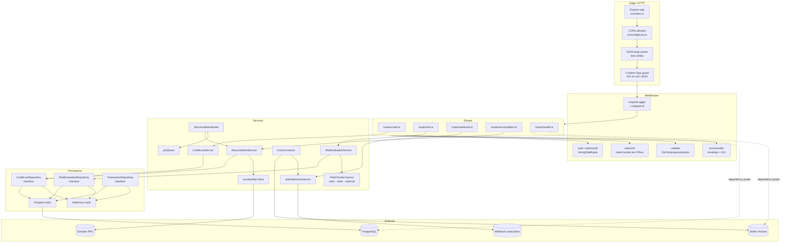
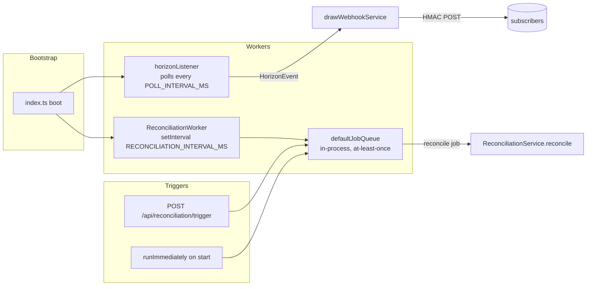

# Backend Architecture

This document describes how the Creditra backend is structured, how a request flows through it, and how the off-chain world stays consistent with the on-chain credit protocol.

> Status: living document. Authoritative for the **off-chain** components of the protocol; on-chain (Soroban) contract internals live in the `Creditra-Contracts` repo.

---

## 1. Component Topology



### Wiring

- **Bootstrap** ([`src/index.ts`](../src/index.ts)) constructs the Express app, registers CORS, body parser, content-type guard, request logger, route mounts, and the global error handler — in that order.
- **DI Container** ([`src/container/Container.ts`](../src/container/Container.ts)) is a lazy singleton. On first `getInstance()` it selects a repository implementation based on `DATABASE_URL` + `NODE_ENV`, constructs the service layer, instantiates the Soroban client and reconciliation pipeline, and registers the default in-process `jobQueue`.
- **Graceful shutdown** is bounded by `SHUTDOWN_TIMEOUT_MS` (default 30 s) and stops in this order: HTTP server → reconciliation worker → job queue → DB pool.

---

## 2. Request Lifecycle

```mermaid
sequenceDiagram
    autonumber
    participant Client
    participant Express
    participant CORS
    participant BodyParser as express.json (100kb)
    participant CTGuard as Content-Type guard
    participant ReqLog as requestLogger
    participant Auth as auth / adminAuth
    participant Rate as rateLimit
    participant Validate as validate(Zod)
    participant Route as route handler
    participant Service as Service layer
    participant Repo as Repository
    participant DB as PostgreSQL
    participant Err as errorHandler

    Client->>Express: HTTPS request<br/>X-API-Key, X-Request-Id
    Express->>CORS: allowlist check
    CORS->>BodyParser: pass
    BodyParser->>CTGuard: parsed body or 413
    CTGuard->>ReqLog: 415 on non-JSON mutating
    ReqLog->>ReqLog: assign / propagate request-id
    ReqLog->>Auth: x-api-key timingSafeEqual
    Auth-->>Client: 401 missing / 403 invalid
    Auth->>Rate: ok
    Rate->>Rate: window bucket; emit X-RateLimit-*
    Rate-->>Client: 429 + Retry-After
    Rate->>Validate: ok
    Validate->>Validate: Zod safeParse → 400 + field details
    Validate->>Route: typed req.body / query / params
    Route->>Service: call domain method
    Service->>Repo: persist / fetch
    Repo->>DB: SQL via pg.Client
    DB-->>Repo: rows
    Repo-->>Service: typed entity
    Service-->>Route: result
    Route-->>Client: ok(res, data) envelope
    Note over Route,Err: any throw is caught by errorHandler
    Err-->>Client: { data: null, error } + status
```

Cross-cutting guarantees:

- **One envelope.** Successful responses use `ok(res, data, status?)`; failures use `fail(res, error, status?)` ([`src/utils/response.ts`](../src/utils/response.ts)).
- **One request id.** `requestLogger` reuses `x-request-id` from the client when present, otherwise generates a UUID, and echoes it back as a response header.
- **Body limits.** `express.json({ limit: '100kb' })` and a `Content-Type` guard for `POST/PUT/PATCH`.

---

## 3. Database Schema Overview

Schema is defined in [`migrations/001_initial_schema.sql`](../migrations/001_initial_schema.sql) and [`migrations/002_add_interest_rate_to_credit_lines.sql`](../migrations/002_add_interest_rate_to_credit_lines.sql). At boot, [`src/db/validate-schema.ts`](../src/db/validate-schema.ts) asserts the expected tables, columns, and critical indexes exist.

```mermaid
erDiagram
    borrowers ||--o{ credit_lines : "has many"
    borrowers ||--o{ risk_evaluations : "scored as"
    credit_lines ||--o{ transactions : "produces"
    events }o--|| credit_lines : "references via aggregate_id"

    borrowers {
        uuid id PK
        text wallet_address UK
        timestamptz created_at
        timestamptz updated_at
    }
    credit_lines {
        uuid id PK
        uuid borrower_id FK
        numeric(28,8) credit_limit
        text currency
        text status
        int interest_rate_bps
        timestamptz created_at
        timestamptz updated_at
    }
    risk_evaluations {
        uuid id PK
        uuid borrower_id FK
        int risk_score
        numeric(28,8) suggested_limit
        int interest_rate_bps
        jsonb inputs
        timestamptz evaluated_at
    }
    transactions {
        uuid id PK
        uuid credit_line_id FK
        text type
        numeric(28,8) amount
        text currency
        timestamptz created_at
    }
    events {
        uuid id PK
        text event_type
        text aggregate_type
        uuid aggregate_id
        jsonb payload
        text idempotency_key UK
        timestamptz created_at
    }
    schema_migrations {
        text version PK
        timestamptz applied_at
    }
```

Index highlights:
- `borrowers.wallet_address` unique
- `credit_lines (borrower_id, status)` composite
- `risk_evaluations (borrower_id, evaluated_at DESC)`
- `transactions (credit_line_id, created_at)`
- `events.idempotency_key` partial-unique where non-null

### Repository pattern

Every aggregate has an interface in [`src/repositories/interfaces/`](../src/repositories/interfaces/) with two implementations:

| Interface | Postgres | In-memory |
|---|---|---|
| `CreditLineRepository` | `PostgresCreditLineRepository` | `InMemoryCreditLineRepository` |
| `RiskEvaluationRepository` | _(uses in-memory until a Postgres impl lands)_ | `InMemoryRiskEvaluationRepository` |
| `TransactionRepository` | _(in-memory)_ | `InMemoryTransactionRepository` |

The container selects an implementation based on `DATABASE_URL && NODE_ENV !== 'test'`. Tests can substitute repositories via `Container.setRepositories()` without touching service code.

---

## 4. Cache & Rate-Limit Topology

### Risk evaluation cache

- TTL = **24 hours** from `evaluatedAt`, surfaced as `expiresAt` on the `RiskEvaluation` model.
- Cache is keyed per wallet and short-circuited unless `forceRefresh: true`.
- Future eviction job: `cleanupExpiredEvaluations()` removes entries past TTL.

### Rate limit

Implemented in [`src/middleware/rateLimit.ts`](../src/middleware/rateLimit.ts):

- Token bucket per window: `windowMs` and `maxRequests` from `RATE_LIMIT_*` env vars.
- Two key generators ship in the codebase: `createIpKeyGenerator()` and `createApiKeyKeyGenerator()` (falls back to IP when no API key present).
- Emits standard headers: `X-RateLimit-Limit`, `X-RateLimit-Remaining`, `X-RateLimit-Reset`. On exhaustion emits `Retry-After` and `429`.
- Store is in-process; for multi-replica deployments a Redis adapter is the natural drop-in.

### Idempotency

- `events.idempotency_key` for replayable command-style events.
- Horizon listener computes `eventId = sha256(ledger ‖ contractId ‖ topics ‖ data)` and keeps a 10 000-entry LRU set to deduplicate across polls.
- Webhook payload carries a stable `data.drawId`; subscribers should ignore retries by id.

---

## 5. Background Workers & Queues



| Worker | Configured by | Cadence | Failure handling |
|---|---|---|---|
| `horizonListener` | `HORIZON_*` env vars | `POLL_INTERVAL_MS` (default 5 s) | Exponential backoff + jitter, rate-limit pause (`HORIZON_RATE_LIMIT_DELAY_MS`), cursor-gap recovery up to `HORIZON_MAX_CURSOR_GAP` ledgers |
| `ReconciliationWorker` | `RECONCILIATION_INTERVAL_MS`, `RECONCILIATION_RUN_IMMEDIATELY` | default 1 h | Critical mismatches throw → job retried by queue; warnings logged |
| `defaultJobQueue` | in code | tick-driven | `maxAttempts` then dead-letter (`getFailedJobs()`) |
| `drawWebhookService` | `WEBHOOK_*` env vars | event-driven | `maxRetries` × backoff multiplier × timeout |

---

## 6. Auth & Session Model

Creditra exposes two perpendicular auth schemes — neither uses cookies or sessions:

- **`X-API-Key`** → public-facing protected endpoints (e.g. `POST /api/risk/admin/recalibrate`, `/api/reconciliation/*`). Checked in constant time by [`createApiKeyMiddleware`](../src/middleware/auth.ts). Keys live in `API_KEYS` (comma-separated) and are resolved per-request, enabling hot rotation.
- **`X-Admin-Api-Key`** → privileged credit-line transitions (suspend/close). Checked in [`adminAuth`](../src/middleware/adminAuth.ts). When the env var is absent, the endpoint returns `503` so that operators always know the auth surface is "off" rather than open.

Read endpoints are public by design but rate-limited.

### Response status semantics

| Status | Meaning |
|---|---|
| 200 | Successful read or action (`{ data, error: null }`) |
| 201 | Resource created |
| 204 | Successful delete (no body) |
| 400 | Validation failure (Zod issues mapped to `{ field, message }`) |
| 401 | Auth header missing |
| 403 | Auth header present but invalid |
| 404 | Resource not found |
| 409 | Invalid state transition (e.g. closing an already-closed line) |
| 413 | Body > 100 kB |
| 415 | Mutating request without `application/json` Content-Type |
| 429 | Rate limit exhausted; `Retry-After` included |
| 500 | Unhandled error — envelope keeps stack out |
| 503 | Admin auth not configured |

---

## 7. Configuration

All boot-time config flows through [`src/config/`](../src/config/) loaders:

- `env.ts` — validates required vars (`DATABASE_URL`, `API_KEYS`) and coerces optionals.
- `apiKeys.ts` — parses comma-separated keys into a `Set<string>`, returned fresh from `loadApiKeys()` so a SIGHUP-style rotation is possible without restart.
- `cors.ts` — strict allowlist in production (`CORS_ORIGINS`), loopback fallback elsewhere.
- `rateLimit.ts` — window + max-request defaults plus the special `RATE_LIMIT_MAX_EVALUATE` for the expensive risk endpoint.

Env-var reference is in [`.env.example`](../.env.example) and (for the listener) [`docs/HORIZON_LISTENER_CONFIG.md`](./HORIZON_LISTENER_CONFIG.md).

---

## 8. Where to look next

- Endpoint-by-endpoint shapes → [`docs/API.md`](./API.md)
- Signal collection & on-chain handoff → [`docs/SIGNALS_INGEST.md`](./SIGNALS_INGEST.md)
- Cursor & reorg model → [`docs/INDEXER.md`](./INDEXER.md)
- Threat model → [`docs/SECURITY.md`](./SECURITY.md)
- Logs, metrics, probes → [`docs/OBSERVABILITY.md`](./OBSERVABILITY.md)
