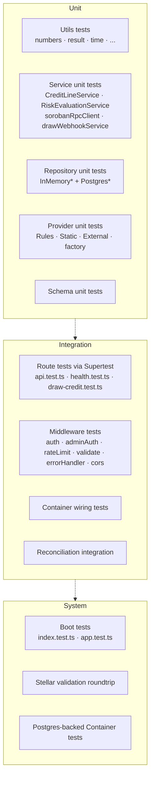

# Testing

The backend ships with a layered test suite designed so every domain decision is provable from the test directory alone. The numbers and tiers below are auto-verifiable — see commands at the end of each section.

---

## 1. By the Numbers

| Metric | Value | How to reproduce |
|---|---|---|
| Total `*.test.ts` files | **67** | `find . -path ./node_modules -prune -o -name '*.test.ts' -print \| grep -v node_modules \| wc -l` |
| Co-located test files under `src/**/__tests__/` and `src/**/__test__/` | **50** | `find src -name '*.test.ts' \| wc -l` |
| Integration tests under `tests/` | **17** | `find tests -type f -name '*.ts' \| wc -l` |
| Test directories | **10** | `find src -type d \( -name __tests__ -o -name __test__ \)` |
| Coverage threshold (touched modules, Node 20) | **95 %** statements/branches/functions/lines | [`.github/workflows/backend-ci.yml`](../.github/workflows/backend-ci.yml) |
| Node matrix tested in CI | **18.x, 20.x, 22.x** | same |

---

## 2. Test Pyramid



### Unit (~33 files)

Domain rules, in isolation, no I/O:

- `src/utils/__tests__/` — `fetchWithTimeout`, `httpStatus`, `numbers`, `objects`, `result`, `strings`, `time`, `constants`.
- `src/services/__tests__/` — `CreditLineService`, `RiskEvaluationService`, `sorobanClient`, `sorobanRpcClient`, `drawWebhookService`.
- `src/repositories/memory/__tests__/` — In-memory implementations of all repositories.
- `src/repositories/postgres/__tests__/` — Postgres CreditLine repository with a stub `DbClient`.
- `src/services/providers/__tests__/` — `RulesEngineRiskProvider`, `StaticRiskProvider`, `ExternalApiRiskProvider`, `providerFactory`.
- `src/utils/__tests__/stellarAddress.test.ts`, `logRedact.test.ts`.

### Integration (~20 files)

Boundaries exercised end-to-end against an in-memory container:

- `tests/api.test.ts` — happy-path GETs through the full Express middleware chain, response envelope assertions.
- `tests/health.test.ts` — readiness envelope + content-type assertions.
- `tests/rateLimit.test.ts` — verifies `X-RateLimit-*` headers on the credit and risk routes.
- `tests/draw-credit.test.ts` — draw endpoint validation, Stellar address parsing, pending status.
- `tests/cors.test.ts` — `isAllowedCorsOrigin()` matrix (loopback fallback, production allowlist).
- `tests/response.test.ts` — `ok()`/`fail()` envelope helpers.
- `tests/middleware/*` — `errorHandler`, `rateLimit`, `validate`, body limits.
- `src/routes/__tests__/reconciliation.integration.test.ts` — schedule → run → status flow.

### System (~11 files)

Tests that boot the whole `app`:

- `src/__tests__/app.test.ts`, `index.test.ts` — middleware order, swagger mount, graceful shutdown shape.
- `src/container/__tests__/Container.test.ts` and `Container.postgres.test.ts` — selects in-memory vs Postgres impls correctly.
- `src/__tests__/stellar_validation.test.ts` — round-trip address handling across services.

### Load (k6, not in `npm test`)

`scripts/load/`:

- `smoke.js` — 10 VUs, baseline thresholds (p95 < 500 ms, errors < 5 %).
- `stress.js` — 50→100 VUs, p95 < 1 s, errors < 10 %.
- `spike.js` — 200 VU spike, p95 < 2 s, errors < 15 %.

Run via `npm run load:smoke|stress|spike` (k6 binary required).

---

## 3. How to Run

```bash
# Fast inner loop
npm test                  # vitest --run
npm run test:watch        # rerun on change
npm run test:coverage     # v8 coverage report → coverage/lcov.info, coverage/index.html

# Single file
npx vitest --run tests/api.test.ts

# Single test by name
npx vitest --run -t "should return 200 with health envelope"

# Quality gates
npm run lint              # eslint src/
npm run typecheck         # tsc --noEmit
npm run validate:spec     # parses src/openapi.yaml — catches structural drift
```

CI executes the full set on each push and PR via [`.github/workflows/backend-ci.yml`](../.github/workflows/backend-ci.yml) on Node 18 / 20 / 22 with coverage enforced on Node 20.

---

## 4. Coverage

Configured in [`vitest.config.ts`](../vitest.config.ts):

```ts
coverage: {
  provider: 'v8',
  thresholds: { statements: 95, branches: 95, functions: 95, lines: 95 },
  exclude: ['src/index.ts', 'src/__tests__/**'],
  reporter: ['text', 'lcov', 'html'],
}
```

Output paths after `npm run test:coverage`:

- `coverage/lcov.info` — uploaded as the CI artifact.
- `coverage/index.html` — drilldown by file.

`src/index.ts` is excluded because it's the boot harness (`new Container().listen(...)`), exercised end-to-end by `tests/api.test.ts` rather than unit tests.

---

## 5. Fixtures & Doubles

- The DI container makes substitution trivial: tests call `Container.getInstance().setRepositories(stubs)` to swap implementations.
- Risk providers default to `StaticRiskProvider` in tests for determinism.
- HTTP fakes use Supertest against the Express app — **never** the real network.
- The Soroban client default is `MockSorobanClient`, returning empty datasets, so reconciliation tests can assert behaviour under various drift conditions by composing repository state vs mock client output.

---

## 6. Test Discipline

1. **One Arrange-Act-Assert per `it`.** Repeat blocks rather than nesting; keeps regressions readable.
2. **Boundaries, not implementations.** Service tests assert on what was persisted via the repository, not on which private helper was called.
3. **No real network.** `npm test` must run offline. Outbound HTTP is tested via `fetchWithTimeout`'s own tests and via mocked `fetch`.
4. **Fail-fast schemas.** Schema tests are the cheapest place to assert validation rules; route tests then only need to confirm wiring.
5. **Reproducibility.** Avoid `Date.now()` directly in tests — use `nowSeconds()` or freeze time per Vitest's modern timers when behaviour depends on TTL/cache windows.

---

## 7. References

- Vitest config: [`vitest.config.ts`](../vitest.config.ts)
- ESLint config: [`.eslintrc.cjs`](../.eslintrc.cjs)
- TS config: [`tsconfig.json`](../tsconfig.json)
- CI: [`.github/workflows/backend-ci.yml`](../.github/workflows/backend-ci.yml)
- Load testing: [`docs/load-testing.md`](./load-testing.md)
